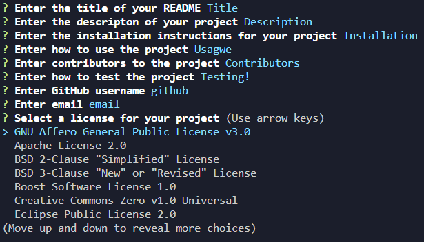

# README Generator

## Description

A README generator that uses user input via the inquirer package. This project also utilizes Node.js and axios for API calls to Github for license generation.

## Installation

## Usage

To use, clone this repository and run `npm i` to install the required packages. After installation, use `node index.js` to run the program.

## Contribution

Tiarnan Marsten

## License

